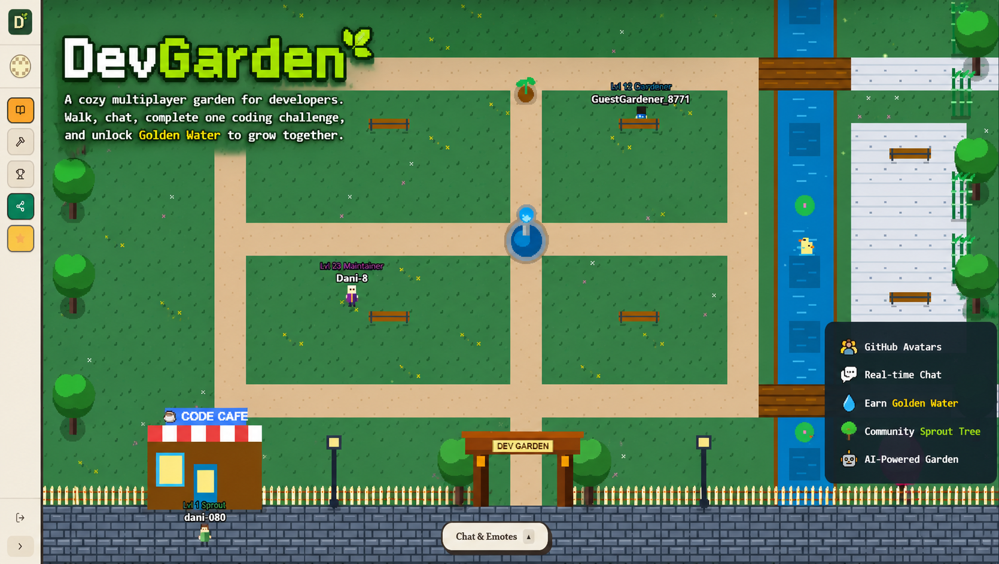

<p align="center">
  
</p>

<p align="center">
  
</p>

Welcome to **DevGarden** — an interactive multiplayer 2D pixel-art greenhouse sandbox for developers! Log in via GitHub, walk around as your custom retro character avatar, chat in real-time with peers, and showcase your profile on a live scoreboard. 

Every developer's character level, guild titles, cosmetic clothing sets, and sparkling magical trails are procedurally generated directly from their real-world GitHub contribution history.

---

## ✨ New Major Features

### 🧠 Custom AI Specialty Challenges
Nurture the Sprout Tree with **10x Golden Water** by conquering specialized coding challenges.
- **Dynamic Specialties**: Type *any* custom technology specialty (e.g., Svelte, Go, Rust, GCP, Docker, CSS).
- **Gemini-Powered Challenges**: Generates a quick custom conceptual Q&A or single-line code completion challenge tailor-made for your field.
- **Instant Rewards**: Solve the challenge to unleash spectacular golden trail visual effects and gain a **10x growth multiplier** for the community garden!

### 🎨 Visual Cohesion & Hover States
- **Aesthetic Avatar Filtering**: All GitHub profile pictures are dynamically styled with a custom-engineered sepia, foliage-green hue-shift filter matching our cozy natural color palette perfectly.
- **Interactive Micro-Transitions**: Hovering over any avatar on the scoreboard, sidebar, or inspector smooths out the colors to reveal their original image with fluid transition feedback.
- **Readable Interface**: Upgraded proximity prompts with comfortable human fonts for maximum legibility and comfort.

---

## 🛠️ Stack Architecture

- **Backend**: Node.js + Express with Supabase and `dotenv` (serves auth, realtime game state, and API routes)
- **AI Core**: `@google/genai` TypeScript SDK (Gemini prompt synthesis and challenge verification)
- **Frontend Engine**: Vite + Phaser 3 (2D physics, particle effects, and dynamic canvas textures)
- **UI Framework**: React + Tailwind CSS + Lucide Icons + motion (interactive UI, menus, and HUD)

---

## 🚀 Step-by-Step GitHub OAuth Setup

Since OAuth flows cannot safely run inside parent-restricted sandbox frames, DevGarden implements a secure, popup-based OAuth authorization mechanism. To enable logins in your environment, perform these steps:

### 1. Register a GitHub OAuth App (local development)
1. Go to your GitHub profile settings: **[GitHub Developer Applications Dashboard](https://github.com/settings/developers)**.
2. Click **New OAuth App** and configure for local development:
   - **Application Name**: `DevGarden`
   - **Homepage URL**: `http://localhost:3000`  (frontend)
   - **Authorization Callback URL**: `http://localhost:3001/auth/callback`  (backend)

Note: The OAuth callback must point to the backend endpoint that completes the server-side exchange. In this project the frontend runs on `http://localhost:3000` and the backend runs on `http://localhost:3001`.

### 2. Configure Environment Variables (local)
Set environment variables carefully so local auth and redirects use the correct ports. Update `backend/.env` (critical for login) and optionally `frontend/.env` for client-side values.

Backend (`backend/.env`) — required values and examples:

```
# backend/.env (local example)
APP_URL=http://localhost:3000

CLIENT_ID=your_github_client_id
CLIENT_SECRET=your_github_client_secret

# IMPORTANT: must match the OAuth app's Authorization Callback URL
GITHUB_REDIRECT_URI=http://localhost:3001/auth/callback

SUPABASE_URL=your_supabase_url
SUPABASE_ANON_KEY=your_supabase_anon_key
SUPABASE_SERVICE_ROLE_KEY=your_service_role_key

GEMINI_API_KEY=your_gemini_api_key
```

Frontend (`frontend/.env`) — client-side values used by Vite (prefix with `VITE_`):

```
# frontend/.env (client-side)
VITE_APP_URL=http://localhost:3000

# URL your frontend will call for API requests (backend origin)
VITE_API_URL=http://localhost:3001

# Supabase client config (used for Realtime / Presence / client queries)
SUPABASE_URL=https://your-supabase-project.supabase.co
SUPABASE_ANON_KEY=your_supabase_anon_key
```

Notes:
- `VITE_API_URL` should point to your running backend (`http://localhost:3001`) so the frontend calls local APIs during development.
- `SUPABASE_ANON_KEY` is intended for safe client-side use (read, realtime, presence). Never expose `SUPABASE_SERVICE_ROLE_KEY` or `CLIENT_SECRET` in the frontend; keep them only in `backend/.env`.

Important notes and checklist:
- The `GITHUB_REDIRECT_URI` in `backend/.env` **must** equal the Authorization Callback URL you register on GitHub (`http://localhost:3001/auth/callback`).
- `APP_URL` should be the frontend origin (`http://localhost:3000`) so backend redirects return users to the correct frontend page after auth.
- Keep `CLIENT_SECRET` and `SUPABASE_SERVICE_ROLE_KEY` secret. Do not commit `backend/.env` with secrets to source control.

---


## 💻 Local Commands (clear per-folder workflow)

Project layout:
- `backend/` — Express + Socket.io server (runs on port `3001` in dev)
- `frontend/` — Vite + React app (runs on port `3000` in dev)


Run the projects for local development — open two terminal windows and run the backend and frontend separately.

- Terminal A (backend): start the backend dev server (watches TypeScript changes)

```bash
cd backend
npm install
npm run dev
```

- Terminal B (frontend): start the Vite dev server

```bash
cd frontend
npm install
npm run dev
```

Open the frontend at `http://localhost:3000`. The frontend calls the backend at `http://localhost:3001` (see `VITE_API_URL`).

Environment files summary:
- `backend/.env` — required for server runtime and OAuth redirect (`GITHUB_REDIRECT_URI=http://localhost:3001/auth/callback`).
- `frontend/.env` — optional client values (`VITE_API_URL=http://localhost:3001`, `SUPABASE_*` keys).

Security reminder: never commit `backend/.env` with `CLIENT_SECRET` or `SUPABASE_SERVICE_ROLE_KEY` to source control.

---


<table>
  <tr>
    <td valign="top" width="60%">
      <strong>Spread the word</strong>
      <p>If you find DevGarden useful, please help the project grow:</p>
      <ul>
        <li><strong>Star</strong> the repository on GitHub to support the project.</li>
        <li><strong>Create an issue or PR</strong> if you spot bugs or want to contribute features.</li>
        <li><strong>Share</strong> a short post on LinkedIn or X (Twitter) linking to the repo — mention interesting features like live multiplayer, GitHub-based rewards, and Supabase realtime presence.</li>
      </ul>
      <p>"Check out DevGarden — a multiplayer pixel-art greenhouse for developers with GitHub-powered avatars, realtime chat, and coding challenges.</p>
      <p>
        <strong>Play the live game here:</strong> <a href="https://dev-garden-35o4.vercel.app/">https://dev-garden-35o4.vercel.app/</a><br />
        <strong>Support the project on GitHub:</strong> <a href="https://github.com/Dani-8/DevGarden">https://github.com/Dani-8/DevGarden</a> 🚀"
      </p>
    </td>
    <td valign="top" width="40%">
      <!--  -->
      
    </td>
  </tr>
</table>

<p align="center">
  
</p>